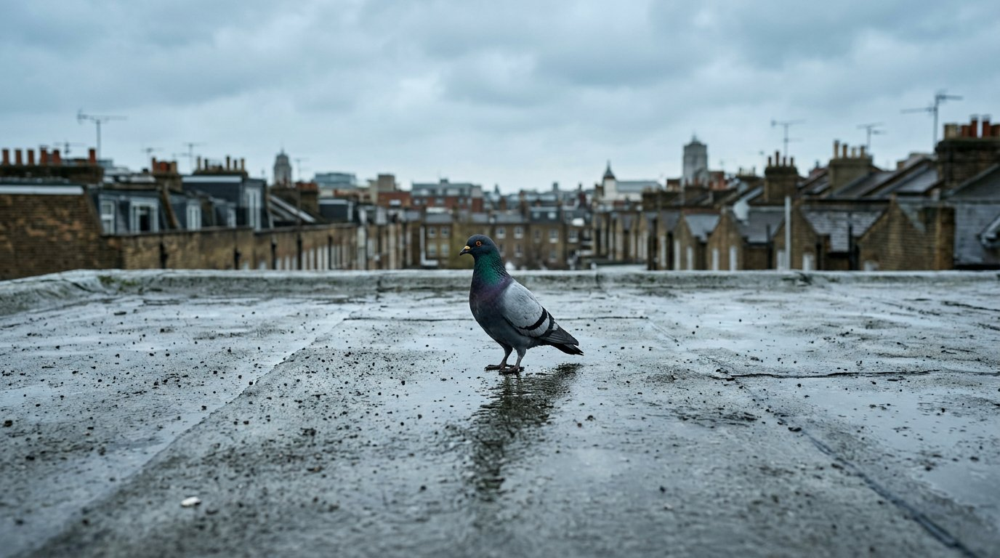
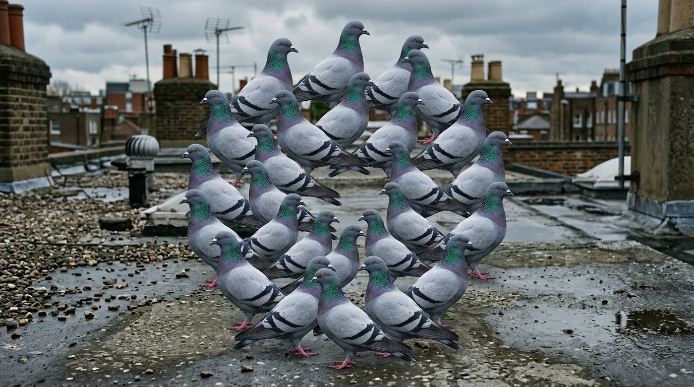

# FASE 0 — Brief de conceito

**Peça:** *COO*  
**Duração-alvo:** 75 s (loop) · **Formato:** 1920×1080, 30 fps · **Áudio:** eletrônico original, 128 BPM  
**Status:** aguardando aprovação escrita para avançar à Fase 1

---

## 1. Elemento central

Um **pombo-das-rochas** (*Columba livia*) urbano: corpo compacto, silhueta fechada, iridescência verde-violeta no pescoço, caminhar em *head-bob*.

Porquê este sujeito (e não vaca, ovelha, gato ou ganso — já “Cyriakados”):

- o *head-bob* é um metrônomo embutido para a Fase 4 (picos nos beats);
- a forma é curta e opaca — máscara limpa, sem patas longas nem caudas que viram retângulos mal recortados;
- o cenário urbano (laje molhada, céu de nublado britânico) diferencia a peça do pastoral de *cows & cows & cows* / *Baaa*, sem abandonar o animal mundano que o estilo exige.

Uma única ave. Sem figurantes humanos. Sem texto. Sem “efeito” aplicado no clipe inteiro.

## 2. Arco narrativo — 75 s

Cinco blocos de 15 s (= 8 compassos a 128 BPM). A **contagem visível de cópias** é o único motor dramático.

| t     | compassos | o que se vê |
|-------|-----------|-------------|
| 0–15  | 8         | **1** pombo, câmera travada, laje molhada. Head-bob no pulso. Estabelece o loop. |
| 15–30 | 8         | **2 → 4.** Cópias coladas do mesmo recorte, offset leve de posição / escala / rotação. Ainda legível como “o mesmo pombo”. |
| 30–45 | 8         | **8 → 16.** Arranjo geométrico (anel, depois grelha solta). Primeiro pico de densidade no downbeat do compasso 17. |
| 45–60 | 8         | **32+.** Mandala / roda de pombos. Cópias orbitam e trocam de escala nos beats fortes. Segundo pico (clímax). |
| 60–75 | 8         | **Colapso.** As cópias refluem para o pombo único da abertura, na mesma pose e posição — frame 0 ≡ frame final, loop fechado. |

Não há “história” aparte da proliferação. O pombo não ganha poderes, não fala, não viaja. Ele **aumenta**.

## 3. Som — BPM e estilo

- **128 BPM, 4/4**, tom menor (referência harmónica: *Baa* remix em Lá menor @ 130; *Cows* @ 150; *7 Billion* @ 150).
- Idioma: **eletrónica hipnótica tipo FL Studio / tracker** — kick seco, ostinato de synth em oitavas, hats em 16as, *stabs* nos downbeats. Sem vocal, sem *riser* de trailer, sem *glitch-hop* decorativo.
- A trilha **ganha camadas** na mesma curva da contagem de cópias (1 camada → 2 → 4…). Os picos de multiplicação dos blocos 3 e 4 caem em beats fortes, nunca em densidade constante.
- Referência de mood (não de cópia): Cyriak *Cows* / *Baa*, Boards of Canada no *pad*, Aphex Twin (*Windowlicker*) só no rigor rítmico.

Fase 4 extrai onsets (librosa) e amarra a função `n_copies(t)` aos beats. Fase 0 só trava o contrato: **a música é a espinha; a contagem é a carne.**

## 4. Paleta visual

Fotografia directa, nublado, sem grade. **Não** há VHS, aberração cromática, vinheta vintage nem LUT “surreal”.

| papel        | hex       | nota |
|--------------|-----------|------|
| asfalto molhado | `#3A3D40` | fundo dominante |
| corpo do pombo  | `#7A7E82` / `#C4C0B8` | cinza-pérola |
| iridescência    | `#5B8A6A` / `#6B4C7A` | verde / violeta no pescoço |
| céu             | `#D4DCE3` | overcast UK |
| bico / olho     | `#E8A317` / `#1A1A1A` | único ponto quente |
| tijolo húmido   | `#8B5A4A` | acento de borda, uso raro |

Luz: céu coberto, sombras moles, reflexo fraco na laje. O “surreal” vem **só** da quantidade de cópias no mesmo plano.

Moodboard (intenção de paleta e densidade — **não** são frames do filme; a proliferação real será colagem de recortes do mesmo pombo):

## 5. Três Cyriak mais próximos

1. **[cows & cows & cows](https://www.youtube.com/watch?v=FavUpD_IjVY)** (2010, ~2'15) — o template: um animal mundano, câmera fixa, proliferação fractal por composição de recortes. É a regra da peça.
2. **[Baaa](https://www.youtube.com/watch?v=WQO-aOdJLiw)** (2011, **80 s**) — “experiments in ovine geometry”: cópias arranjadas em figura, não em pilha. Duração quase idêntica à nossa. Geometria > caos.
3. **[HONK](https://youtu.be/u08E7c-FRbU)** (2023, **86 s**) — ave, beat electrónico, multiplicação sincronizada. Prova que o mesmo método aguenta 60–90 s sem virar filtro.

Fora do trio (inspiração pontual, não modelo): *7 billion* (coelhos → Droste) só para o *gag* opcional do bloco 4, “pombo feito de pombos”, se a composição aguentar sem artefacto de bloco.

## 6. Contrato técnico (para não desviar nas fases seguintes)

A técnica central é **composição de recortes**, não tratamento de imagem:

1. isolar o pombo (máscara / recorte);
2. instanciar N cópias no mesmo frame;
3. cada cópia com Δposição, Δescala, Δrotação pequenos;
4. `N(t)` sobe 1 → 2 → 4 → 8 → 16 → 32+ e desce no colapso;
5. N muda em **degraus nos beats**, não em rampa contínua invisível.

**Reprovado automaticamente** (já falhou antes, não repetir):

- filtro glitch / VHS / aberração / “cor vintage” sobre o clipe;
- 1–2 instâncias do início ao fim;
- distorção mecânica constante, sem pico;
- blocos/retângulos congelados (máscara suja).

**Gate da Fase 2 (objectivo):** o último frame do protótipo tem de mostrar **≥ 8 cópias visíveis** do pombo.

## 7. Plano de assets (Fase 1 — ainda não executar)

6–8 cut-outs curtos (3–6 s) do **mesmo** pombo, câmera fixa, fundo neutro, loopáveis: idle+bob, passo no sítio, virar cabeça E/D, bicar, eriçar, garganta de *coo*. Fonte prevista: stills fotográficos gerados + puppet cut-out (linha Gilliam/Cyriak), não stock com câmera à solta.

---

**Pronto quando:** aprovação escrita deste brief.

Para avançar: `aprovado, prossiga para fase 1`.
